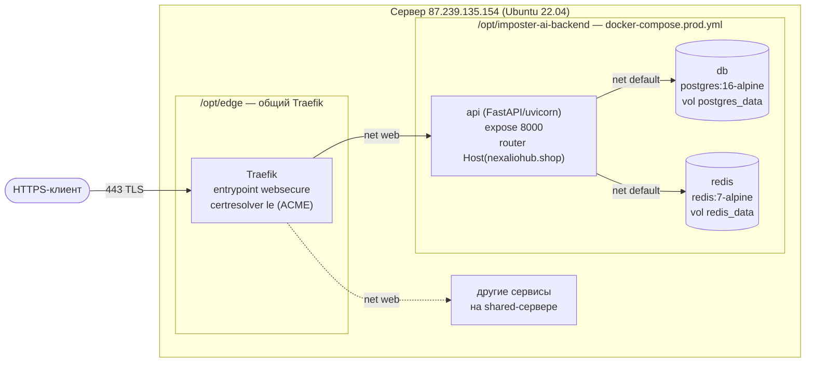
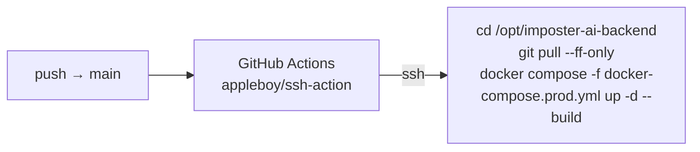

# 07 — Deployment (production)

Источник истины по фактической топологии развёртывания **imposter-ai-backend**. Описывает прод-стенд за общим Traefik. Локальная разработка — см. [SETUP.md](../SETUP.md) (dev `docker-compose.yml`, host-порты, `--reload`).

> **Решение по топологии:** [ADR-004](adr/ADR-004-traefik-shared-edge-deployment.md) — общий Traefik-edge + standalone prod-compose.

---

## 1. Топология



**Ключевые принципы:**

- **TLS терминирует Traefik**, не сервис. ACME certresolver `le` (Let's Encrypt) выпускает и автоматически продлевает сертификат для `nexaliohub.shop`.
- **Сервис не публикует хостовые порты.** `api` доступен только через Traefik по сети `web`; `db`/`redis` — только внутри сети `default` стека (наружу не видны).
- **Маршрутизация — через Docker-метки** на контейнере `api`, Traefik читает их через Docker-провайдер.
- **Изоляция от чужих сервисов:** общая только внешняя сеть `web` (edge ↔ сервисы). Внутренний трафик `api ↔ db ↔ redis` идёт по приватной сети `default`, недоступной другим compose-проектам. Уникальность маршрута гарантируется именем роутера `imposterai` и `Host(nexaliohub.shop)`.

---

## 2. Сервер и каталоги

| Параметр | Значение |
|---|---|
| Хост | `87.239.135.154` (Ubuntu 22.04) |
| Каталог сервиса | `/opt/imposter-ai-backend` |
| Каталог edge (Traefik) | `/opt/edge` |
| Домен | `nexaliohub.shop` (A-запись → `87.239.135.154`) |

---

## 3. Сети Docker

| Сеть | Тип | Назначение |
|---|---|---|
| `web` | `external: true` | Общая сеть edge ↔ сервисы. Создаётся в `/opt/edge` вместе с Traefik. `api` подключён к ней для приёма трафика от Traefik. |
| `default` | стека (auto) | Приватная сеть прод-стека. `api`, `db`, `redis` общаются внутри неё (`POSTGRES_HOST=db`, `REDIS_HOST=redis`). |

`db` и `redis` подключены **только** к `default` → не доступны ни Traefik, ни другим сервисам сервера.

---

## 4. Домен и TLS

Роутер Traefik (метки на контейнере `api` в `docker-compose.prod.yml`):

| Метка | Значение |
|---|---|
| `traefik.enable` | `true` |
| `traefik.http.routers.imposterai.rule` | `Host(\`nexaliohub.shop\`)` |
| `traefik.http.routers.imposterai.entrypoints` | `websecure` |
| `traefik.http.routers.imposterai.tls.certresolver` | `le` |
| `traefik.http.services.imposterai.loadbalancer.server.port` | `8000` |

Сертификат выпускается и продлевается автоматически certresolver'ом `le` (определён в конфиге Traefik в `/opt/edge`). Сервис в выпуске сертификатов не участвует.

---

## 5. Прод-стек (`docker-compose.prod.yml`)

Standalone-файл (не `extends` dev `docker-compose.yml`): без bind-mount `./api`, без host-портов, `command` без `--reload`.

| Сервис | Образ / билд | Сети | Порты | Том | Healthcheck |
|---|---|---|---|---|---|
| `api` | build `./api/Dockerfile` | `web`, `default` | `expose 8000` (наружу не публикуется) | `./keys:/app/keys:ro` | `GET /healthz` → 200 |
| `db` | `postgres:16-alpine` | `default` | — | named `postgres_data` | `pg_isready` |
| `redis` | `redis:7-alpine` (`--appendonly yes`) | `default` | — | named `redis_data` | `redis-cli ping` |

**`command` контейнера `api` (выполняется при каждом старте):**

```sh
alembic upgrade head && python seed.py && uvicorn main:app --host 0.0.0.0 --port 8000
```

1. `alembic upgrade head` — применяет миграции (`0001_initial`, `0002_processed_webhook_events`). Идемпотентно.
2. `python seed.py` — загружает seed-контент. В прод-образе используется `api/seed_words.json` (попадает в образ через `COPY . .` в `Dockerfile`; bind-mount `docs/seed_words.json`, как в dev, в проде не применяется). Файлы синхронизированы байт-в-байт (см. TD-001).
3. `uvicorn` — запуск приложения на `0.0.0.0:8000` без `--reload`.

`api.depends_on` ждёт `service_healthy` у `db` и `redis` перед стартом.

---

## 6. Секреты и `.env` на сервере

`/opt/imposter-ai-backend/.env` (chmod `600`, gitignored). Шаблон — [.env.example](../.env.example). На сервере заданы:

| Группа | Переменные | Источник значения |
|---|---|---|
| Аутентификация | `API_KEY`, `ADMIN_API_KEY` | сгенерированы на сервере |
| Adapty | `ADAPTY_WEBHOOK_SECRET` (bearer, ADR-002) | сгенерирован на сервере |
| БД | `POSTGRES_DB=imposter_ai`, `POSTGRES_USER=imposter`, `POSTGRES_PASSWORD` | пароль сгенерирован на сервере |
| OpenAI | `OPENAI_API_KEY`, `OPENAI_MODEL` | внешний |
| Токеномика | `SUBSCRIPTION_PRODUCT_*`, `SUBSCRIPTION_TOKENS_*`, `SUBSCRIPTION_TOKENS_GRANT`, `AI_THEME_TOKEN_COST` | конфигурация (ADR-002/003) |
| JWT | `JWT_PRIVATE_KEY_PATH=./keys/private.pem`, `JWT_PUBLIC_KEY_PATH=./keys/public.pem`, `JWT_ALGORITHM=RS256` | пути к ключам |

Секреты в коде/репозитории не хранятся. `.env` правится только на сервере.

### JWT RSA-ключи

Генерируются **на сервере** в `/opt/imposter-ai-backend/keys` (каталог gitignored), монтируются в `api` как `:ro`:

```bash
mkdir -p /opt/imposter-ai-backend/keys
openssl genpkey -algorithm RSA -out /opt/imposter-ai-backend/keys/private.pem -pkeyopt rsa_keygen_bits:2048
openssl rsa -in /opt/imposter-ai-backend/keys/private.pem -pubout -out /opt/imposter-ai-backend/keys/public.pem
```

Алгоритм подписи — RS256 (`JWT_ALGORITHM=RS256`).

---

## 7. CI/CD

`.github/workflows/deploy.yml`: `push` в `main` → деплой по SSH.



- **Concurrency:** `group: deploy-production`, `cancel-in-progress: false` — деплои не накладываются.
- **Команда на сервере:** `git pull --ff-only` (только fast-forward) → `docker compose -f docker-compose.prod.yml up -d --build` → `docker compose ... ps`.

**Требуемые GitHub Secrets:**

| Secret | Назначение |
|---|---|
| `SSH_HOST` | `87.239.135.154` |
| `SSH_USER` | пользователь сервера |
| `SSH_PRIVATE_KEY` | приватный SSH-ключ для входа |

---

## 8. Первичный деплой (runbook)

Предусловия: на сервере поднят общий Traefik в `/opt/edge`, создана внешняя сеть `web`, A-запись `nexaliohub.shop` → `87.239.135.154`.

1. Клонировать репозиторий в `/opt/imposter-ai-backend`.
2. Сгенерировать JWT-ключи в `./keys` (см. §6).
3. Создать `.env` из `.env.example`, заполнить секреты, `chmod 600 .env`.
4. Поднять стек:
   ```bash
   cd /opt/imposter-ai-backend
   docker compose -f docker-compose.prod.yml up -d --build
   ```
5. Дождаться `healthy` у `api` (`docker compose -f docker-compose.prod.yml ps`).
6. Smoke-test (см. §10).
7. Прописать GitHub Secrets (`SSH_HOST`, `SSH_USER`, `SSH_PRIVATE_KEY`) для автодеплоя.

---

## 9. Обновление (deploy)

Автоматически при `push` в `main` (CI/CD, §7). Вручную на сервере — эквивалентно:

```bash
cd /opt/imposter-ai-backend
git pull --ff-only
docker compose -f docker-compose.prod.yml up -d --build
```

Миграции и seed применяются автоматически в `command` контейнера `api` (§5). Named-тома `postgres_data`/`redis_data` переживают пересборку → данные сохраняются.

---

## 10. Healthcheck и smoke-test

| Проверка | Ожидание |
|---|---|
| Внутренний healthcheck контейнера | `GET http://localhost:8000/healthz` → 200 |
| Внешний smoke | `GET https://nexaliohub.shop/healthz` → 200 + валидный Let's Encrypt сертификат |
| Алиас | `GET /health` → 200 |

```bash
curl -fsS https://nexaliohub.shop/healthz
```

---

## 11. Rollback

Named-тома сохраняют данные БД при откате кода:

```bash
cd /opt/imposter-ai-backend
git checkout <prev-sha>
docker compose -f docker-compose.prod.yml up -d --build
```

> ⚠️ Откат **кода**, не схемы БД. Миграции вперёд накатываются автоматически; down-миграции `command` не выполняет. Откат на ревизию с несовместимой (более старой) схемой требует ручной обработки БД и в текущей процедуре не покрыт.

---

## 12. Известный tech debt деплоя

- [TD-003](100-known-tech-debt.md#td-003--api-dockerfile-запускает-процесс-от-root) — `api/Dockerfile` запускает uvicorn от `root` (нет `USER`). Рекомендован non-root user. **major**, container security.
- [TD-004](100-known-tech-debt.md#td-004--базовые-образы-запиннены-по-тегу-не-по-digest) — базовые образы (`python:3.12-slim`, `postgres:16-alpine`, `redis:7-alpine`) запиннены по тегу, не по digest. **minor**.
